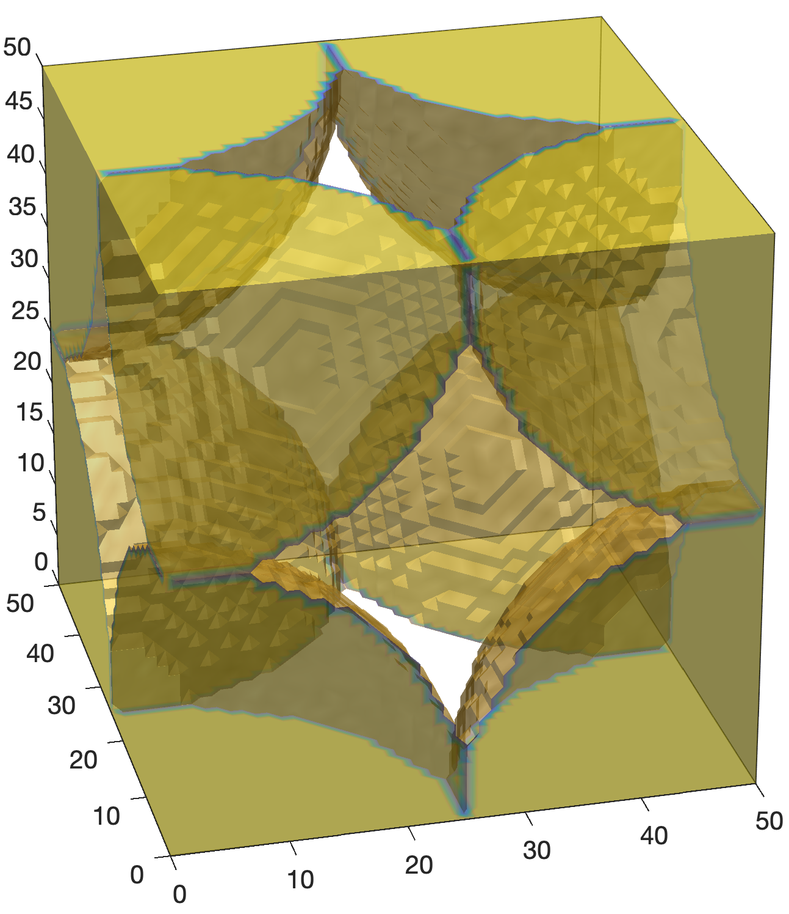
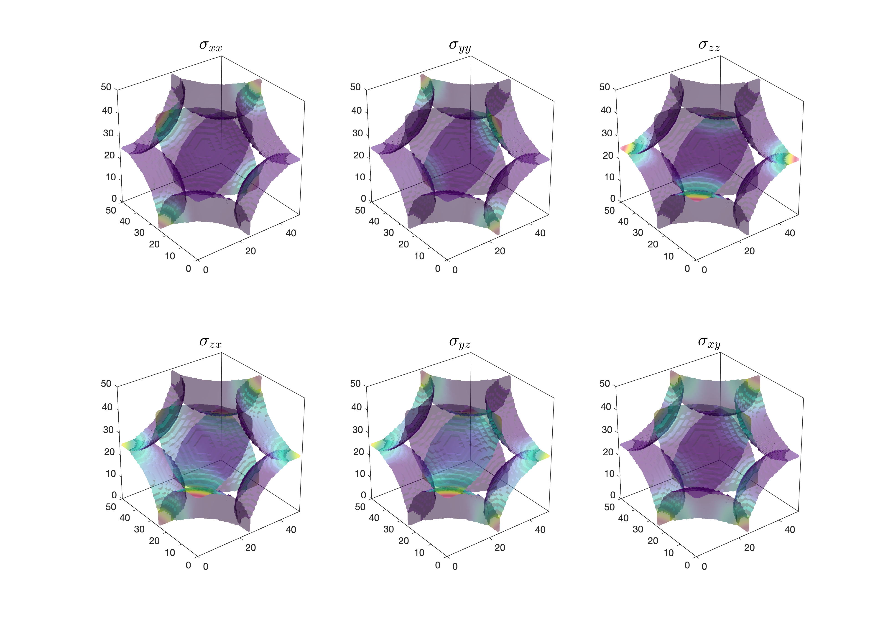

# NIST Elastic UNIX version (Mac/Linux)
## About
This is an example and slight modification of the work by Edward J. Garboczi **Finite Element and Finite Difference Programs for Computing the Linear Electric and Elastic Properties of Digital Images of Random Materials**. See the original work for more information.

The software computes computes the stresses and elastic properties.

 This version works to sizes up to 400x400x400 in size. For bigger sizes modify the source code, or use newer version available in fortran90 with dynamic memory allocation.

 We provide a sample test of size 51x51x51 with a simple cubic pack of spheres, in the file **RockTest51x51x51.txt**, it is a flattened 3D matrix, such as the one generated by matlab in the following way:
 ```
 N=51;
 matrix3=round(rand(N,N,N));
 flatenned3Dmatrix=matrix3(:);
 ```

### Pack of spheres


### Stress results computed with software


## Running the software

On the folder containing the files compute the source code with the following line, here we use GNU fortran compiler:

```
gfortran EMC3D.f -o EMC3D
```

To run the software type:

```
./EMC3D emc3d.pam
```

## Parameter file
To modify simple parameters of the simulation change the parameter file **emc3d.pam**:
```
RockTest51x51x51.txt                    : File Location
51 51 51                                : nx, ny, nz
1.0e-7                                  : Conv criteria
0                                       : Header Lines
0                                       : Write Stress (0=no;1=yes)
2                                       : No of Phase
0.2 0 1                                 : K,mu,density (phase 0 - Brine)
36.6 44.0 2.65                          : K,mu,density (phase 1 - Quartz)
0.001 0.001 0.001 0.002 0.002 0.002     : Applied strain (engineering)
```

## Output
If write stess = 0 only the output file **outputfile.out** will be created/modified:
It contains steps of the simulation and the computed properties for the material at the end (here we show the end of the file only):
```
                               :
                               :
 0.10000E-02   0.10000E-02   0.10000E-02   0.20000E-02   0.20000E-02   0.20000E-02

K       :      1.00792
G       :      0.54198
density :      1.47047
Porosity:      0.46256
Vp      :      1.08484
Vs      :      0.60711
E       :      1.37881
Poisson :      0.27200
```
